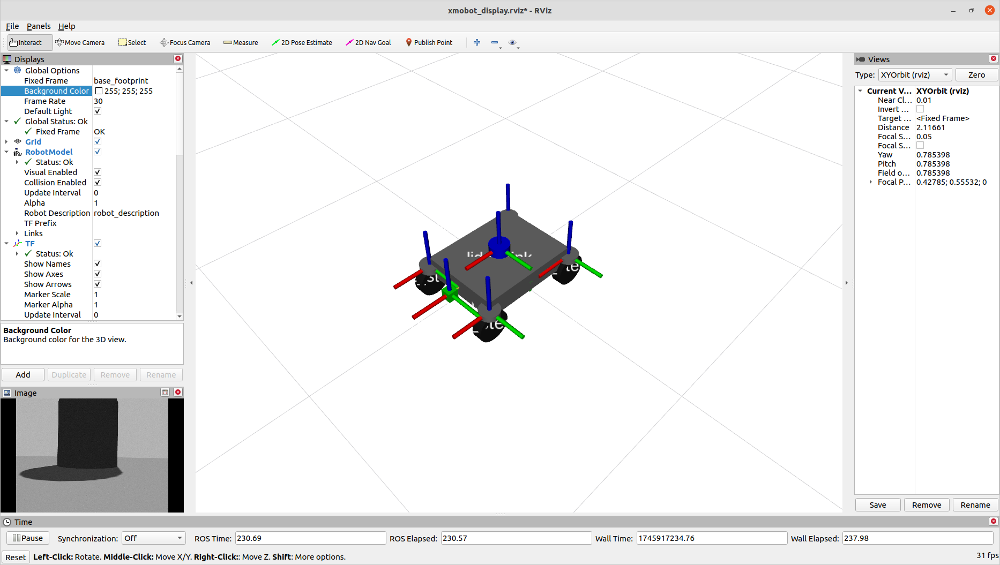
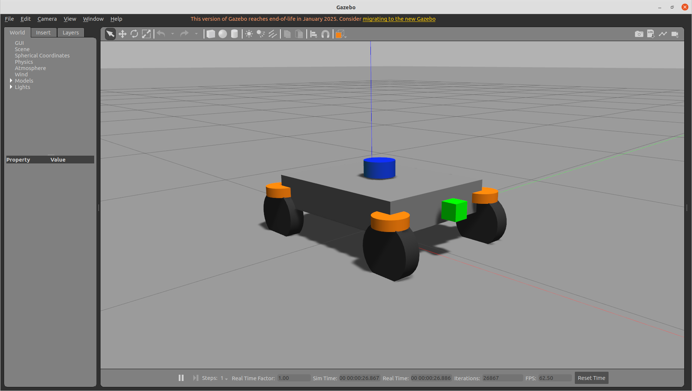
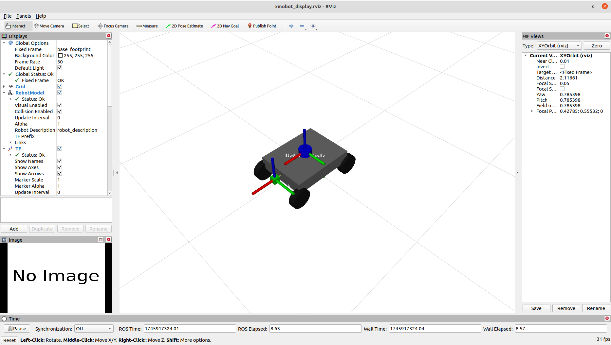
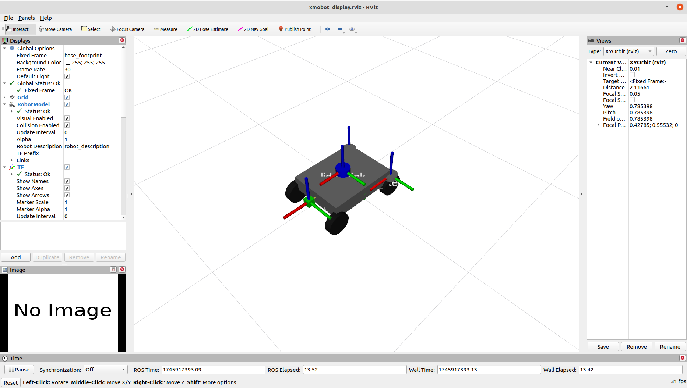
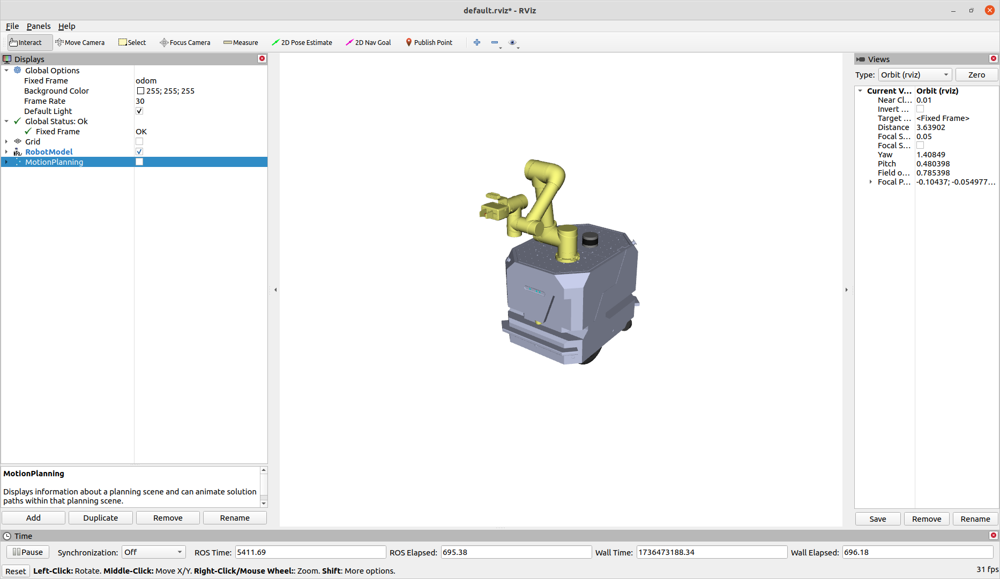

<p align="center">
  
</p>

# Xmobot
Xmobot is a flexible, modular mobile robot platform for SLAM, path planning, and navigation research benchmarking across diverse drive types, including differential, Ackermann, Mecanum (omnidirectional drives), and four-wheel independent steering with driving (4WISD).

---

## Features
- Support for ROS1 Noetic
- Modular robot design (X-Shape 4-wheel configuration)
- Parameterized robot size and drive mode
- Equipped with Laser Lidar and Front Camera
- Gazebo simulation ready
- Easy to extend to other mobile bases

---

## System Requirements

- **Ubuntu 20.04 LTS**
- **ROS1 Noetic** installed
- Recommended tools:
  - RViz
  - Gazebo 9 (comes with ROS Noetic)
  - `robot_state_publisher`, `joint_state_publisher`, `teleop_twist_keyboard`
    ```bash
    sudo apt install ros-noetic-joint-state-publisher ros-noetic-robot-state-publisher ros-noetic-xacro ros-noetic-teleop_twist_keyboard
    ```
If you don't have ROS1 Noetic installed yet, follow [this guide](http://wiki.ros.org/noetic/Installation/Ubuntu).

---

## Quick Start

### 1. Clone the repository

```bash
cd ~/catkin_ws/src
git clone https://github.com/YeatsWang/xmobot.git
cd ~/catkin_ws
catkin_make
source devel/setup.bash
```
If you don't have a catkin_ws workspace yet:
```bash
mkdir -p ~/catkin_ws/src
cd ~/catkin_ws/
catkin_make
```

### 2. Launch the Xmobot model in RViz
```bash
roslaunch xmobot display.launch
```
This brings up RViz with the modular Xmobot URDF model. You can visualize different drive configurations (diff, mecanum, ackermann, 4wis), along with Lidar and Camera sensors.


### 3. Launch the Xmobot simulation in Gazebo (optional)
```bash
roslaunch xmobot gazebo.launch
```
You will see Xmobot spawned in a simple flat world. You can change the drive_type parameter to test other configurations.


**Available drive type**:
- diff_drive: Differential drive (default)
- mecanum: Omnidirectional drive with mecanum wheels
- ackermann_front: Front-wheel Ackermann steering
- ackermann_rear: Rear-wheel Ackermann steering
- 4wis: Four-Wheel Independent Steering (with driving)

To switch between drive modes, simply pass the desired drive_type:
```bash
roslaunch xmobot gazebo.launch drive_type:=4wis
```
Make sure your controller configuration in config/controllers.yaml matches your selected drive type.
#### Differential Drive or Mecanum Drive: drive_type:=diff_drive or mecanum

#### Ackermann Front Steering: drive_type:=ackermann_front

#### Ackermann Rear Steering: drive_type:=ackermann_rear

#### Differential Drive: drive_type:=4wis


### 4. Low-Level Controller Testing (Recommended)
You can directly test velocity and steering controllers without requiring teleop or navigation stack:

**Publish wheel velocities (rad/s):**
~~~bash
rostopic pub /velocity_controller/command std_msgs/Float64MultiArray "data: [2.0, 2.0, 2.0, 2.0]" -r 10
~~~
**Publish steering angles (rad):**
~~~bash
rostopic pub /front_left_steering_controller/command std_msgs/Float64 "data: 0.2"
rostopic pub /front_right_steering_controller/command std_msgs/Float64 "data: 0.2"
rostopic pub /rear_left_steering_controller/command std_msgs/Float64 "data: -0.2"
rostopic pub /rear_right_steering_controller/command std_msgs/Float64 "data: -0.2"
~~~
**Check loaded controllers:**
~~~bash
rosservice call /controller_manager/list_controllers
~~~
### 5. Keyboard Teleoperation
If you have implemented a kinematic conversion layer, you can use keyboard teleoperation to control it:
~~~bash
rosrun teleop_twist_keyboard teleop_twist_keyboard.py cmd_vel:=/cmd_vel
~~~

---

## Project Structure
```plaintext
xmobot/
├── README.md             # 项目首页描述
├── urdf/
│   ├── xmobot_base.xacro         # 基础机器人主体
│   ├── xmobot_inertial.xacro     # 惯性矩阵计算
│   ├── xmobot_sensors.xacro      # 激光雷达+相机模块
│   ├── xmobot_drive.xacro        # 驱动方式参数（差速、阿克曼、全向）
│   ├── xmobot_gazebo.xacro       # Gazebo仿真设置和Transmission接口
│   ├── xmobot.urdf.xacro         # 主入口，组合调用以上模块
├── config/
│   ├── control_gazebo.yaml       # 控制器参数
├── launch/
│   ├── display.launch.py   # RViz展示
│   ├── gazebo.launch.py    # Gazebo仿真
├── meshes/                 # 模型网格文件
│   ├── base.dae
│   ├── wheel.dae
│   ├── steering_link.dae
│   ├── lidar.stl
│   ├── camera.stl
├── scripts/
│   ├── model_test.py       # 测试脚本
├── worlds/
│   ├── simple_world.world  # Gazebo仿真环境
├── LICENSE
```

---

## Current Issues:
During startup of Gazebo simulation, you may encounter warning messages similar to:
~~~
[ERROR] [1745910964.801114479]: No p gain specified for pid.  Namespace: /gazebo_ros_control/pid_gains/front_left_wheel_joint
[ERROR] [1745910964.801282865]: No p gain specified for pid.  Namespace: /gazebo_ros_control/pid_gains/front_right_wheel_joint
[ERROR] [1745910964.801428305]: No p gain specified for pid.  Namespace: /gazebo_ros_control/pid_gains/rear_left_wheel_joint
[ERROR] [1745910964.801565093]: No p gain specified for pid.  Namespace: /gazebo_ros_control/pid_gains/rear_right_wheel_joint
[ERROR] [1745910964.801702513]: No p gain specified for pid.  Namespace: /gazebo_ros_control/pid_gains/front_left_steering_joint
[ERROR] [1745910964.801836766]: No p gain specified for pid.  Namespace: /gazebo_ros_control/pid_gains/front_right_steering_joint
[ERROR] [1745910964.801965428]: No p gain specified for pid.  Namespace: /gazebo_ros_control/pid_gains/rear_left_steering_joint
[ERROR] [1745910964.802093729]: No p gain specified for pid.  Namespace: /gazebo_ros_control/pid_gains/rear_right_steering_joint
~~~
- This occurs because gazebo_ros_control expects PID parameters for each velocity or position controlled joint.
- When pid_gains are not explicitly set, a warning is logged.
- However, if you use velocity_controllers/JointGroupVelocityController or position_controllers/JointPositionController, these controllers can function without PID parameters in simulation.

When PID parameters are fully configured for all joints, Gazebo may experience model instability or collapse under specific conditions.
- **Root cause**: Likely due to simplified mechanical structure, approximated inertial parameters, or imperfect collision modeling.
- **Impact**: This does **not** affect basic simulation, controller testing, or URDF-based functionality at present.

---

## Contribution
We welcome contributions!
If you want to:
- Improve mechanical design and model fidelity
- Solve parameters tuning issues (PID + physics parameters optimization)
- Add new sensor modules (3D LiDAR or Depth camera)
- Expand to ROS2 support (URDF/Xacro, Gazebo, Controllers)

Please feel free to submit pull requests or open issues!

---

## Extended Robot Models based on Xmobot
CsuBot: Mobile robot (diff_drive) with manipulator


CsuAmr: Four-Wheel Independent Steering and Driving mobile robot 


---

## License
This project is licensed under the MIT License.
